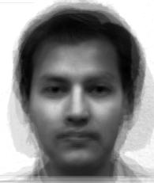

# CS-GY 6643 Project 2: Face Recognition

By Vin Liu zl1477

---
## How to Run
1. Please make sure `project_2.py` is in the same folder with the folder `Face dataset`
2. This project is using library `numpy` and `matplotlib`.
   
   If you don't have them installed, please use the following commands to install them:

   `pip3 install numpy`

   `pip3 install matplotlib`
3. `cd` to the project folder and run it using `python3 project_2.py` in your terminal. Mean face and Eigenfaces will be generated in the same folder.

---
## Results and Outputs
### Screenshot of the Output


---
### Mean face *m*

### 8 Eigenfaces Computed From the Training Images
#### For subject01.normal.jpg

#### For subject02.normal.jpg

#### For subject03.normal.jpg

#### For subject07.normal.jpg

#### For subject10.normal.jpg

#### For subject11.normal.jpg

#### For subject14.normal.jpg

#### For subject15.normal.jpg


---
### The Eigenface Coefficients of the Training Images
1. The Eigenface coefficient of image "subject01.normal.jpg" is:
[-7.58393182e+07  9.86591897e+07 -3.00843695e-09 -7.35308451e+07
  2.03390545e+07  2.09059360e+07 -1.34689494e+07  4.95663886e+06]
2. The Eigenface coefficient of image "subject02.normal.jpg" is:
[ 8.55914694e+07 -5.32769258e+07 -5.70789205e-08 -4.35819945e+04
 -1.02912808e+07  7.27564771e+07 -2.36191334e+07 -2.56112293e+07]
3. The Eigenface coefficient of image "subject03.normal.jpg" is:
[ 6.79094869e+07  2.86096157e+07  5.29828581e-09 -2.11976451e+07
 -9.00930120e+06 -6.14469992e+07  3.38368115e+06 -4.32998677e+07]
4. The Eigenface coefficient of image "subject07.normal.jpg" is:
[ 1.59365384e+08 -5.98976188e+07  4.63117736e-08  3.62392288e+07
  2.39421030e+07 -2.99666082e+07 -3.11659201e+07  1.50158366e+07]
5. The Eigenface coefficient of image "subject10.normal.jpg" is:
[-2.57010807e+07  5.31036358e+07  9.27940899e-09  7.67395071e+07
  1.13657321e+07  2.13665227e+07  4.79155988e+07 -8.39149947e+06]
6. The Eigenface coefficient of image "subject11.normal.jpg" is:
[-3.09965508e+08 -1.01569225e+08 -2.39078528e-08 -7.23282904e+06
  3.43527729e+05 -1.38164759e+07  4.01893283e+06  6.69097274e+05]
7. The Eigenface coefficient of image "subject14.normal.jpg" is:
[-5.48035678e+07  7.56177219e+07  2.95419598e-08  4.07897743e+07
 -2.52009615e+07 -9.97235825e+06 -2.99136079e+07  2.68289508e+07]
8. The Eigenface coefficient of image "subject15.normal.jpg" is:
[ 1.53443135e+08 -4.12463935e+07 -6.43621789e-09 -5.17636090e+07
 -1.14888738e+07  1.73505791e+05  4.28493981e+07  2.98320729e+07]

---
 ### The Eigenface Coefficients and Recognition Result for Each Test Image
1. The Eigenface coefficient of image "subject01.happy.jpg" is:
[-2.84226819e+07  6.21657618e+07 -9.33396854e-09 -5.58402336e+07
  1.39551196e+07  2.39919521e+07 -1.56038461e+07 -4.88745009e+05]
  
    The recognition result of image subject01.happy.jpg is subject01.normal.jpg with a distance of 63067848.6249848
  
    The recognition result is correct

2. The Eigenface coefficient of image "subject07.happy.jpg" is:
[ 1.03893380e+08 -9.15597753e+06  1.49109535e-08  2.31395182e+07
  9.78874352e+05 -3.10262255e+06 -4.00701970e+06  6.01476791e+06]

    The recognition result of image subject07.happy.jpg is subject07.normal.jpg with a distance of 88831686.49484535
    
    The recognition result is correct
3. The Eigenface coefficient of image "subject11.happy.jpg" is:
[-2.91280480e+08 -1.07981032e+08 -2.73025788e-08 -8.07984970e+06
 -3.16856693e+06 -8.84253231e+06 -2.77433359e+06  1.23549801e+06]

    The recognition result of image subject11.happy.jpg is subject11.normal.jpg with a distance of 21783094.363420796
    
    The recognition result is correct
4. The Eigenface coefficient of image "subject14.happy.jpg" is:
[-3.72003742e+07  7.23552596e+07  2.88294239e-08  2.01072900e+07
 -1.10391535e+07 -1.16749219e+07 -3.12504845e+07  1.93984877e+07]

    The recognition result of image subject14.happy.jpg is subject14.normal.jpg with a distance of 31760601.244475823
    
    The recognition result is correct
5. The Eigenface coefficient of image "subject14.sad.jpg" is:
[-3.09557722e+07  6.21419290e+07  2.54144583e-08  4.11282105e+07
 -1.89530184e+07 -9.12193903e+06 -3.02355547e+07  1.57609187e+07]

    The recognition result of image subject14.sad.jpg is subject14.normal.jpg with a distance of 30212478.883972332
    
    The recognition result is correct
---
### The Recognition Accuracy for the Test Dataset
The recognition accuracy for the test dataset is 5/5.

---
## Code
```
import numpy as np
import matplotlib.pyplot as plt
import matplotlib.image as mpimg

# Define training dataset path and file names
TRAINING_DATASET = {"directory": "Face dataset/Training/",
                    "filenames": ["subject01.normal.jpg", "subject02.normal.jpg",
                                  "subject03.normal.jpg", "subject07.normal.jpg",
                                  "subject10.normal.jpg", "subject11.normal.jpg",
                                  "subject14.normal.jpg", "subject15.normal.jpg"],
                    "numbers": 8
                    }
# Define testing dataset path and file names
TESTING_DATASET = {"directory": "Face dataset/Testing/",
                   "filenames": ["subject01.happy.jpg", "subject07.happy.jpg",
                                 "subject11.happy.jpg", "subject14.happy.jpg",
                                 "subject14.sad.jpg"],
                   "numbers": 5
                   }
# Define image dimensions
WIDTH = 195
HEIGHT = 231


# function for reading and displaying image
def read_images(dataset: dict) -> np.ndarray:
    images = np.ndarray(shape=(HEIGHT * WIDTH, dataset.get("numbers")))
    directory = dataset.get("directory")
    for i, filename in enumerate(dataset.get("filenames")):
        img = mpimg.imread(directory + filename)
        r_i = np.array(img).flatten()
        images[:, i] = r_i
        # plt.subplot(2, 4, i + 1)
        # plt.imshow(img, cmap="gray")
    # plt.show()
    return images


# function for calculating and displaying the mean face
def calculate_mean_face(dataset: np.ndarray) -> np.ndarray:
    mean = dataset.mean(axis=1).reshape(HEIGHT * WIDTH, 1)
    mean_face_image = mean.reshape(HEIGHT, WIDTH)
    # plt.imshow(mean_face_image, cmap="gray")
    # plt.show()
    save_image("mean_face.jpg", mean_face_image)
    return mean


# function for saving the image
def save_image(image_name: str, image: np.ndarray) -> None:
    plt.imsave(image_name, image, cmap="gray")
    return None


# Training
# read in training image and define M
m_training = TRAINING_DATASET.get("numbers")
training_data = read_images(TRAINING_DATASET)
# calculate mean face
mean_face = calculate_mean_face(training_data)
# calculate matrix A
matrix_A = training_data - mean_face
# calculate matrix L
matrix_L = np.dot(matrix_A.transpose(), matrix_A)
# find eigenvalues of L
eigenvalues, eigenvectors = np.linalg.eig(matrix_L)
# put eigenvectors of L into a single matrix V
matrix_V = eigenvectors
# calculate matrix U that contains M eigenfaces
matrix_U = np.dot(matrix_A, matrix_V)
# project each training face onto the face space to obtain its eigenface coefficients
omega = np.ndarray(shape=(m_training, m_training))
print("---The Eigenface coefficients of the training images:")
for i, current_image_name in enumerate(TRAINING_DATASET.get("filenames")):
    print(f"--Training with image {current_image_name}:")
    # calculate omega of test image
    omega_i = np.dot(matrix_U.transpose(), matrix_A[:, i])
    omega[i, :] = omega_i
    print(f"-The Eigenface coefficient of image \"{current_image_name}\" is:\n{omega_i}")
# generate and output the eigenfaces of training image
eigenfaces = np.dot(matrix_U, omega)
training_data_eigenface_directory = "eigenfaces/training/"
for i in range(len(eigenfaces.transpose())):
    eigenface = eigenfaces.transpose()[i].reshape(HEIGHT, WIDTH)
    save_image("eigenface_" + TRAINING_DATASET.get("filenames")[i], eigenface)

print()
# Recognition
# read in testing image
m_testing = TESTING_DATASET.get("numbers")
testing_data = read_images(TESTING_DATASET)
# subtract mean face
test_matrix_A = testing_data - mean_face
# calculate eigenface coefficients of testing image
print("---The Eigenface coefficients and recognition results of the testing images:")
count_correct = 0
for i, current_image_name in enumerate(TESTING_DATASET.get("filenames")):
    print(f"--Recognizing image {current_image_name}:")
    # calculate omega of test image
    test_omega_i = np.dot(matrix_U.transpose(), test_matrix_A[:, i])
    print(f"-The Eigenface coefficient of image \"{current_image_name}\" is:\n{test_omega_i}")
    # reconstruct the test image
    test_eigenface = np.dot(matrix_U, test_omega_i)
    # recognize the face using with smallest Euclidean distance
    min_distance = np.inf
    for j in range(m_training):
        distance = np.linalg.norm(test_omega_i - omega[j])
        if distance < min_distance:
            min_distance = distance
            prediction = TRAINING_DATASET.get("filenames")[j]
    print(f"-The recognition result of image {current_image_name} is {prediction} with a distance of {min_distance}")
    if prediction.split(".")[0] == current_image_name.split(".")[0]:
        print("-The recognition result is correct")
        count_correct += 1
    else:
        print("-The recognition result is wrong")
# calculate the recognition accuracy
print(f"---The recognition accuracy for the test dataset is {count_correct / m_testing * 100}%")
```